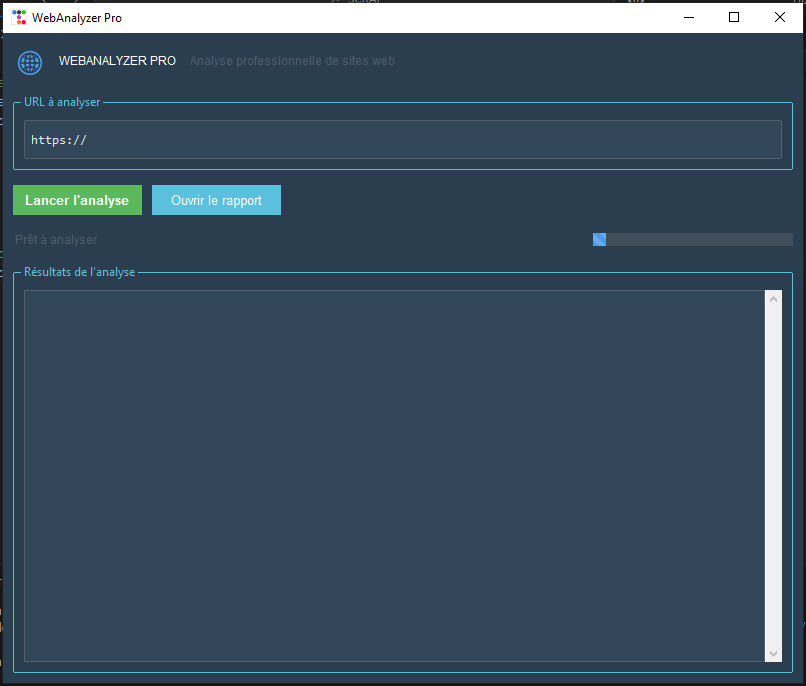

# 🌐 WebAnalyzer Pro

**WebAnalyzer Pro** est une application de bureau avec interface graphique qui permet de scrapper le contenu d’un site web : titres, paragraphes, liens, images, scripts, métadonnées... Le tout sauvegardé dans un rapport `.json` consultable.

---

---

## ⚠️ Avertissement

**Cette application est fournie uniquement à des fins éducatives.**

> 🛑 **L’auteur décline toute responsabilité en cas d’usage malveillant ou de dommages causés par l’utilisation de ce logiciel.**  
> Utilisez ce projet de manière éthique et responsable. 👌

## 🎯 Fonctionnalités

- Interface moderne avec `ttkbootstrap`
- Analyse automatique d'une URL :
  - Titres (`h1`, `h2`, `h3`)
  - Paragraphes (`<p>`)
  - Liens (`<a>`)
  - Images (``)
  - Métadonnées (`<meta>`)
  - Scripts (`<script>`)
- Génération d’un rapport JSON
- Ouverture directe du rapport
- Indicateur de progression et journal des actions

---

## 🖼️ Interface utilisateur

- Thème Bootstrap personnalisable (`superhero` par défaut)
- Champ de saisie URL avec bouton d’analyse
- Affichage des résultats dans une zone scrollable
- Barre de statut et barre de progression
- Bouton pour ouvrir le dernier rapport

## Aperçu de l'application



---

## 🚀 Installation

### 1. Cloner ou télécharger le projet
```bash
git clone https://github.com/christianADE/Scrapping.git
cd Scrapping
pip install -r requirements.txt
python SCRAPPER.py

🙌 Auteur

Développé avec ❤️ par SMART_X
